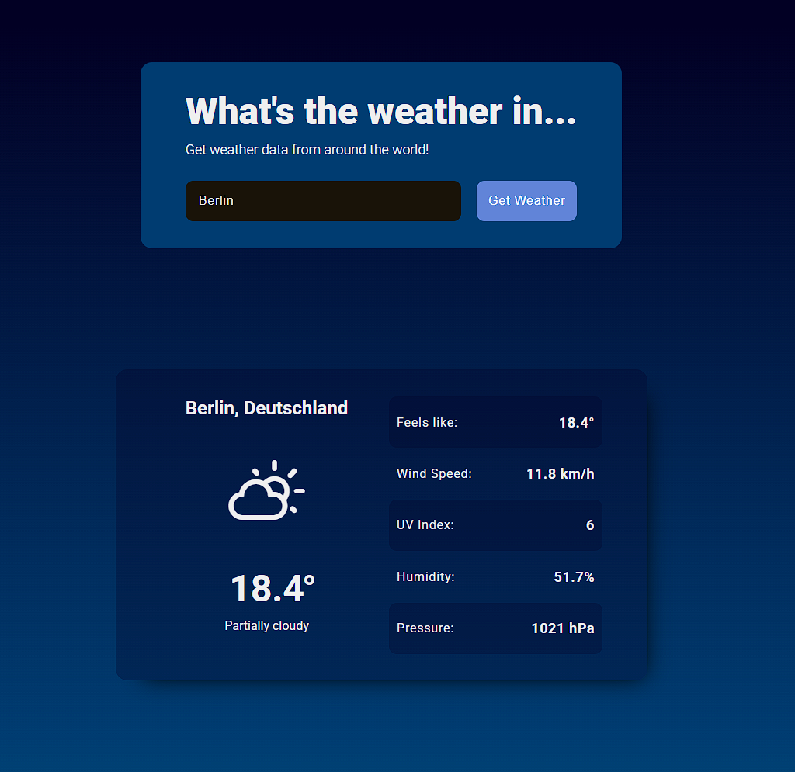

# odin-weather-app
## Odin - Project #11: Weather App

This weather app is able to display the current weather for any location you search for! It uses the [Visual Crossing Weather API](https://www.visualcrossing.com/).

## General Info
Date: 08.06.2025

Hours Working per Day: 5h

Finish: 09.06.2025

Hours Worked: 7h

## Progress
### Progress on Foundations Course: 
✅ Complete

### Progress on Node.js Path
Intermediate HTML and CSS: ✅ Complete

Javascript Course: ~55%
